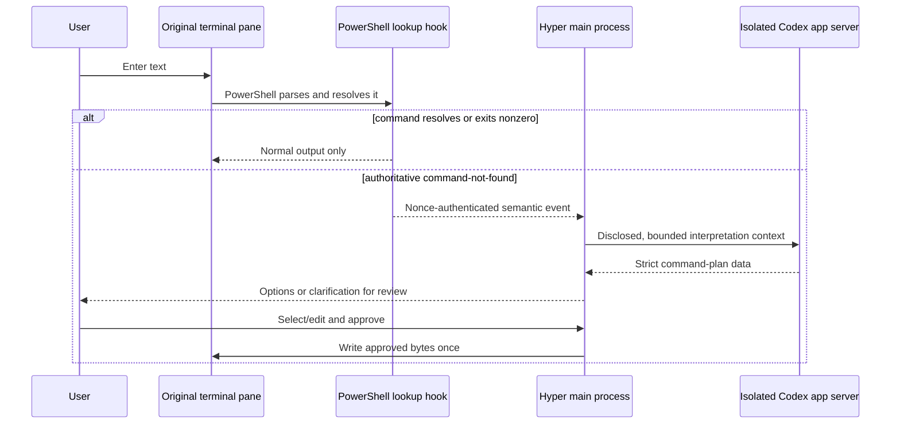
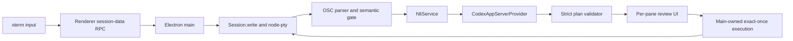

# Natural language interface

Hyper's natural-language interface (NLI) is an optional, shell-first fallback for unresolved PowerShell input. It uses the Codex app server to propose commands, but the model does not replace the terminal command path: Hyper sends every entry to the original PTY first and waits for an authenticated PowerShell command-not-found event before it asks Codex for help.

The feature is disabled and private by default.

## Set up

1. Install a compatible [Codex CLI](https://learn.chatgpt.com/docs/developer-commands?surface=cli) and make `codex` available on `PATH`, or set `codexExecutable` to its absolute path. Hyper requires Codex CLI 0.144.6 or newer and also checks the app-server protocol and isolation capabilities at runtime.
2. On Windows, configure Hyper to start an interactive PowerShell 5.1 (`powershell.exe`) or PowerShell 7 (`pwsh.exe`) session. The default `cmd.exe` session remains a normal terminal but cannot activate automatic fallback.
3. Open **Tools -> Natural Language Setup**.
4. Add the following object under the root `config` object in `hyper.json`, save, and start a new PowerShell tab:

```json
"naturalLanguageInterface": {
  "enabled": true,
  "codexExecutable": "codex",
  "requestTimeoutMs": 30000,
  "maxInputChars": 4096,
  "maxOptions": 3,
  "includeWorkingDirectory": false,
  "includeGitMetadata": false
}
```

The shipped defaults use the same values except `enabled` is `false`. On Windows, `hyper.json` is stored in Hyper's Electron user-data directory. In a development checkout, placing `hyper.json` at the repository root overrides the normal config without changing the installed app's profile.

A Windows PowerShell profile can be selected with the normal Hyper shell settings, for example:

```json
"shell": "C:\\Program Files\\PowerShell\\7\\pwsh.exe",
"shellArgs": ["-NoLogo"]
```

Hyper augments only recognized interactive PowerShell launches. `-Command`, `-EncodedCommand`, `-File`, non-interactive/server modes, positional commands, unknown flags, and conflicting arguments are left untouched and fail closed.

## What happens when you press Enter



There is no output-regex, prompt-text, or exit-code fallback. Valid commands remain on Hyper's existing synchronous input path with no provider construction, request, or await. A resolved command that intentionally returns a nonzero exit code also never invokes Codex. Syntax errors, `cmd.exe`, WSL, SSH, arbitrary shells, and unsupported PowerShell launch modes do not trigger the model.

Codex can return one to three bounded command choices or a clarification question. Hyper validates the complete response before showing it. Choosing another option, editing command text, changing the working directory or shell, entering more terminal input, closing the pane, or changing the plan revision invalidates the old approval. High-risk commands require a second deliberate confirmation. Reject and Cancel write nothing.

An approved command is written once to the same original PTY followed by PowerShell Enter. Hyper does not execute it in a hidden shell. If the synchronous write fails, the UI reports an unknown outcome and does not retry automatically.

## Support matrix

| Session | Automatic fallback | Notes |
| --- | --- | --- |
| Windows PowerShell 5.1 (`powershell.exe`) | Supported | Interactive launches with the accepted argument set; covered by a real PTY test. |
| PowerShell 7 (`pwsh.exe`) | Supported | Interactive launches with the accepted argument set; Windows is covered by real PTY and packaged-app tests. |
| Windows default `cmd.exe` | Not supported | Terminal behavior is unchanged; use a new PowerShell tab for NLI. |
| WSL shells | Not supported | No authoritative adapter is installed. |
| Bash, zsh, fish, SSH, or arbitrary shells | Not supported | No output guessing or exit-code heuristic is used. |
| PowerShell with `-Command`, `-File`, `-EncodedCommand`, non-interactive/server modes, or conflicting arguments | Not supported | Startup arguments remain unchanged. |

The Codex executable path is configurable, but provider support is not based on version alone. Startup validates `initialize`, effective config, and the required disabled-feature list. Account login/read/logout and structured thread/turn operations are validated when those paths are first used. A missing method, older CLI, incompatible response shape, or isolation setting that cannot be verified fails closed with an incompatible-provider error and cannot produce an executable plan.

## Privacy and sign-in

On first use, Hyper shows the disclosure before starting the provider. Required interpretation context consists of:

- the failed input line;
- PowerShell family and version and the operating system;
- an opaque attempt ID; and
- a one-way working-directory fingerprint used to detect stale approvals.

The raw current directory is optional. Limited Git metadata is separately optional and includes only whether the directory is a repository, the branch, staged/unstaged/untracked flags, remote presence, and GitHub CLI availability. Hyper does not add paths, filenames, diffs, commits, remote URLs, terminal history, scrollback, environment variables, clipboard data, or file contents. Secret-looking failed input is screened locally and remains local unless the user separately opts in to share it; this is a heuristic guard, not a guarantee that arbitrary text contains no secret.

Privacy choices are versioned, non-secret, per-install state at `<Hyper userData>/nli/preferences.json`. They apply across profiles and windows. **Reset privacy choices** deletes that file, cancels active interpretations, and requires disclosure again. It does not log out Codex.

**Accept and sign in with ChatGPT** opens the HTTPS browser flow provided by Codex. The renderer receives login state, never OAuth tokens. Hyper starts Codex in the main process with `shell: false`, hidden windows, piped stdio, an empty app-controlled working directory, and a private `<Hyper userData>/nli/codex-home`. Its generated strict config is:

```toml
cli_auth_credentials_store = "keyring"
approval_policy = "never"
sandbox_mode = "read-only"
web_search = "disabled"

[features]
shell_tool = false
apps = false
hooks = false
multi_agent = false
remote_plugin = false
memories = false
goals = false
shell_snapshot = false
```

Hyper reads the effective config and feature list back from the app server and fails closed if these settings are unavailable. It sends no runtime workspace roots or dynamic tools and denies every server tool, file, or approval request before dispatch. The dedicated Codex home contains no Hyper-provided MCP servers, skills, plugins, hooks, memories, or project instructions.

The child process receives an allowlist of platform variables only: path and executable lookup, OS roots, the user's home/profile and app-data locations required by the platform credential store, temporary/runtime/locale variables, and the dedicated `CODEX_HOME`. API keys, access tokens, secrets, MCP/plugin/project variables, terminal profile variables, and `HYPER_NLI_E2E_FIXTURE` are not inherited. Stderr and routine diagnostics are reduced to display-safe state/error codes; command content and tokens are not logged.

Credentials are owned by Codex and must remain in the operating-system keyring. Hyper provides no plaintext or `auth.json` fallback. Codex may refresh a signed-in ChatGPT session while it is in use. Credentials persist until **Log out of Codex** is selected in Natural Language Setup; disabling NLI or resetting privacy choices does not delete them. OpenAI's [Codex authentication](https://learn.chatgpt.com/docs/auth) and [configuration reference](https://learn.chatgpt.com/docs/config-file/config-reference) describe the browser sign-in and `cli_auth_credentials_store = "keyring"` behavior.

## Errors and troubleshooting

- **Unsupported shell:** start a new interactive PowerShell 5.1 or 7 tab. Hyper intentionally cannot infer natural language from `cmd.exe` or WSL output.
- **Codex missing:** run `codex --version` from PowerShell or set an absolute `codexExecutable` path.
- **Codex incompatible:** install a compatible Codex CLI. Version 0.144.6 is the minimum, but the required app-server methods and locked-down config must also pass startup checks.
- **Keyring unavailable:** restore the operating-system credential store. Hyper will not save credentials to a file.
- **Private storage unavailable:** check write permissions for Hyper's user-data directory. No login or command is queued.
- **Offline, rate-limited, or timed out:** the original terminal failure has already completed and remains visible. Retry explicitly; nothing is queued.
- **Invalid suggestion:** Codex returned data outside Hyper's strict plan schema. No partial model output can be approved.
- **Approval expired:** terminal input, cwd, shell, pane identity, selected option, or edit revision changed. Submit the natural-language request again.
- **Approved write has unknown outcome:** inspect the terminal before deciding what to do. Hyper consumes the approval and never retries the write automatically.
- **A generated command fails:** its terminal output stays authoritative and cannot recursively trigger AI. Use the explicit retry action if you want another proposal.

### Threat-model limits

Hyper addresses accidental command spoofing, malformed IPC/OSC/JSONL, token leakage, stale or replayed approvals, unsafe model output, and unexpected Codex tool requests through isolation, strict validation, opaque identities, local risk classification, atomic approval consumption, and fail-closed cancellation. It does not protect against a compromised existing renderer or plugin, a malicious user-configured Codex executable, operating-system or keyring compromise, phishing in the system browser, or hostile terminal code that learns the per-session nonce. The nonce prevents accidental frame collisions; mandatory command review remains the safety boundary.

### Roll back or disable

Set `naturalLanguageInterface.enabled` to `false` for the immediate kill switch. Active provider requests are cancelled, the hidden Codex child is disposed, future sessions are not augmented, and normal terminal input continues unchanged. Close existing PowerShell tabs to dispose their per-session parser and generated hook artifact.

If removing credentials is desired, use **Tools -> Natural Language Setup -> Log out of Codex before downgrading, reverting, or uninstalling**. A downgrade cannot promise to remove a credential already stored by Codex in the OS keyring.

Generated PowerShell hook files contain no credentials and normally disappear when their terminal session closes. After Hyper and all affected PowerShell sessions are closed, an orphan can be removed from `<Hyper userData>/nli/shell-integration/`. Delete only files named `hyper-nli-<session>-<nonce>.ps1`; do not remove the broader Hyper user-data or Codex directories as cleanup.

## Maintainer guide

### Boundaries and protocol



The shell adapter contract is defined by `detectShellIntegration`, `augmentPowerShellArgs`, and `createPowerShellIntegration`. An adapter must preserve existing shell arguments and lookup behavior; emit only after authoritative unresolved lookup; authenticate events to the window/session with an unguessable nonce; bound and validate every field; preserve non-NLI PTY bytes exactly; clean up per-session artifacts; and never add an execution path around `Session.write`.

PowerShell currently emits private OSC frames with the prefix `ESC ] 1337 ; HyperNLI ; 1 ;`, followed by the session nonce, a semicolon, a base64-encoded UTF-8 JSON payload whose `v` is `1`, and BEL or ST termination. The parser incrementally buffers and reassembles a valid frame even when PTY chunks split it at any boundary. It accepts only the bound window/session IDs, nonce, reason, callback ID, field types, sizes, and UTF-8 encoding; malformed, spoofed, oversized, or finally truncated frames remain visible PTY output and cannot invoke the provider.

When changing the protocol version:

1. add a new typed marker contract instead of weakening v1;
2. update the generated PowerShell prefix/payload and `OscEventParser` together;
3. update the nonce, identity, size, malformed, fragmented, BEL/ST, and byte-preservation tests;
4. update the fake provider and packaged Electron fixtures if display behavior changes;
5. update this document and the sequence diagram; and
6. keep old versions rejected unless a separately tested compatibility path is intentionally implemented.

The app server is proposal-only. The public provider boundary is `NliProvider`; command-plan validation, privacy preferences, risk classification, immutable plan revisions, approval consumption, and PTY execution remain owned by Hyper main.

### Deterministic provider fixture

`test/fixtures/nli/fake-provider-e2e.jsonl` drives CI and packaged tests without a live OpenAI account. The seam is inactive unless `HYPER_NLI_E2E_FIXTURE` names a real `.jsonl` repository fixture path under `test/fixtures/nli`. It starts signed out, returns proposal data only, and still passes through normal privacy, validation, risk, approval, and exact-once execution.

For manual development on PowerShell, build/watch Hyper in one terminal, then launch the app with the fixture in another:

```powershell
$env:HYPER_NLI_E2E_FIXTURE = (Resolve-Path 'test/fixtures/nli/fake-provider-e2e.jsonl')
pnpm run app
Remove-Item Env:HYPER_NLI_E2E_FIXTURE
```

Do not use the fixture in a production launch or treat it as an authentication bypass. `app/session.ts` removes the variable from the spawned PTY environment.

### Verification and packaging

Run the complete local gate:

```powershell
pnpm test
pnpm run build
pnpm exec electron-builder --win dir --x64 --publish never
pnpm test:e2e
powershell -NoProfile -ExecutionPolicy Bypass -File scripts/test-nli-packaged.ps1
```

The full unit gate covers config, shell detection, OSC parsing, controller lifecycle, provider/auth, privacy/risk/approval, renderer states, real PowerShell PTYs, latency, and exact-once writes. Electron E2E uses the deterministic provider for consent, login, alternatives, clarification, edit/reapproval, high risk, cancel/retry, malformed/offline, stale cwd, focus, narrow layout, and execution. The packaged smoke uses a unique temporary user-data directory and proves one GUI app window, no console or dangling child window/process, no real Hyper/Codex profile mutation, and exact temporary cleanup.

Live OAuth smoke is optional and never a CI requirement. Run it only with a disposable test setup, inspect that the browser sign-in returns to Hyper, then use **Logout** when finished. Never capture tokens, keyring entries, command content, or user profile data in test logs or snapshots.

### Documentation surface audit

Task 09 re-scanned the documentation surfaces after implementation:

| Surface | Result |
| --- | --- |
| `README.md` | Applicable: added the user entry point, shell-first/default-off summary, maintainer gate link, and explicit `dev` PR base. |
| `docs/natural-language-interface.md` | Applicable: authoritative user, privacy, rollback, protocol, test, and packaging guide. |
| `app/config/config-default.json` | Applicable and already updated: additive, default-off configuration. |
| `typings/config.d.ts` and generated `app/config/schema.json` | Applicable and already updated: typed options and generated schema are aligned. Regenerate with `pnpm run generate-schema` after a config contract change. |
| `PLUGINS.md` | Not applicable: NLI is built into Hyper and exposes no plugin API; its existing dev-config instructions remain correct. |
| Contribution/test guidance | Applicable: exact NLI gates are documented above and linked from `README.md`. |
| Packaging docs | No separate packaging guide exists; the existing `README.md` dist guidance remains general and NLI's Windows command and smoke assertions are documented above. |
| Release/changelog conventions | No repository changelog or release-note file exists to update. Publication must use a pull request explicitly based on `dev`, not `canary`. |
| CI/deploy workflows | Not applicable: the feature intentionally adds no CI or deployment workflow change. |
