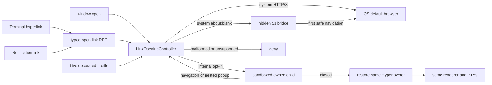

# External-link browser default and popup recovery

## User's Request

Fix the Electron main-process failure that could leave Hyper blank after an internal browser popup closed, make ordinary links use the default browser, retain internal browsing as an option, and complete the work autonomously on `dev`.

## What We Understood

The defect was broader than one click handler: terminal links, notifications, and generic `window.open` requests followed different paths, while Electron-created children lacked an owner-recovery contract. The implementation therefore covers every core web-link entry point, defaults existing and new profiles to the system browser, retains a secure internal opt-in, and explicitly excludes arbitrary protocols, file opening, browser UI, telemetry, and PTY lifecycle changes.

## Overview

Hyper now has one main-process controller for web-link decisions. It launches safe web URLs externally by default, supports a constrained hidden bridge for delayed popup navigation, and manages hardened internal children without reloading or replacing the terminal owner.

## What Was Built

- Added `app/utils/link-opening.ts` with URL classification, live mode resolution, system launching, hidden bridge management, internal-child hardening, recursive popup policy, and idempotent owner recovery.
- Added `config.webLinksOpenMode: 'system' | 'internal'`, defaulting to `system`, plus public typings and regenerated JSON schema.
- Added a typed renderer-to-main `open link` RPC and routed terminal and notification links through it.
- Integrated `setWindowOpenHandler` and `did-create-window` in `app/ui/window.ts` while preserving the existing system-only `open external` API.
- Added nine focused AVA cases covering policy, security, error handling, config merging, nested requests, bridge cleanup, and owner recovery.
- Extended the packaged Electron suite with isolated config/user-data fixtures and a real internal-popup close regression that proves owner and PTY continuity.

## How It Was Achieved

### One decision point

Renderer callers send only a URL. `LinkOpeningController` parses it in main, samples the current decorated profile mode, and chooses deny, external launch, hidden bridge, or managed internal child. This keeps policy consistent and prevents remote values from selecting privileged renderer behavior.

### Safe system default

Direct HTTP(S) launches through Electron `shell.openExternal` and suppresses the Electron popup. Rejections are caught, reported with a URL-redacted message, and surfaced through Hyper's existing notification mechanism. The exact `about:blank` flow receives a hidden five-second bridge so common create-then-navigate scripts still reach the OS browser without a visible or leaked child.

### Hardened internal opt-in

Internal children are parented to the owner with Node integration off, context isolation and sandboxing on, drag navigation off, and `outlivesOpener: false`. Navigation, redirects, and nested popups re-enter the same policy. Closing the child restores, shows, and focuses the existing owner once, with no reload or session cleanup.

### Compatibility and migration

The shipped default participates in Hyper's existing config merge, so omitted values become `system` without rewriting user files. Explicit `internal` profile overrides are honored at click time. Existing Help/menu and plugin callers of `open external` retain their system-only meaning.

## Architecture



## Key Decisions

- Default every omitted or invalid mode to `system`; only the exact `internal` value opts in.
- Allow only HTTP(S) plus exact `about:blank` bridge setup and deny everything else.
- Keep one main-process controller instead of duplicating policy across renderers.
- Preserve explicit `open external` compatibility rather than silently making it configurable.
- Restore the original owner in place and forbid reload-based recovery.
- Redact URL values from launch-failure diagnostics and add no telemetry.
- Place the disruptive owner recovery E2E case last in the shared packaged suite.

## How to Use

No configuration is required for normal use; links now open in the operating system's default browser. To opt into Hyper's managed internal window, set the value in the applicable root or profile configuration:

```json
{
  "webLinksOpenMode": "internal"
}
```

Switch it back to `"system"` or remove the override to restore the default. Live profile config is sampled for the next link.

## Testing

The completed verification matrix passed:

- `pnpm exec ava test/unit/link-opening.test.ts` — 9 focused policy/lifecycle tests.
- `pnpm run test:unit` — 123 unit tests.
- `pnpm run lint -- --no-eslintrc --config .eslintrc.json` — repository lint.
- `pnpm exec tsc -b --pretty false` — TypeScript build.
- `pnpm run generate-schema && git diff --exit-code -- app/config/schema.json` — stable generated schema.
- `pnpm run dist` — Windows x64 and arm64 packaging completed.
- `pnpm run test:e2e` — 9 packaged Electron scenarios, including the internal-popup regression last.
- `git diff --check` and the integration-surface search passed.

The popup regression checks the same owner URL, renderer PID, live session IDs, visible/focused state, focused web contents, a non-empty captured frame, and child count returning to baseline.

## Memories Saved / Learnings

- **Run disruptive Electron owner-recovery E2E checks last** — `testing/electron/lifecycle-ordering/run-disruptive-electron-owner-recovery-e2e-checks-last`. A deliberate Windows hide/minimize/recover cycle can disturb later automation hooks even while the owner and PTY identities remain stable.
- **Plan 002 external-link browser default anchor** — `index/plans/002-external-link-browser-default`. Preserves the original lightweight plan identity and feature location.

## Pull Request

_Pending — filled in by feature-completion.ts after `gh pr create`._

## Plan Location

`plans/active/desktop-reliability/002-external-link-browser-default/`
