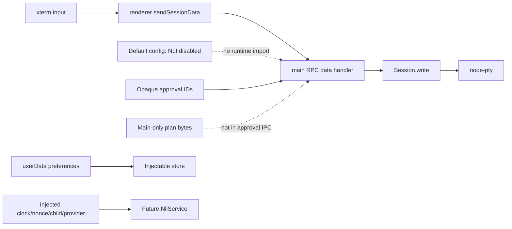

# Task 00: Establish contracts, configuration, and seams

Task 00 establishes compile-time and storage boundaries while leaving the live terminal path untouched. Renderer approvals carry only opaque identifiers; main-owned provider plans retain authoritative command bytes; privacy state is stored separately under userData and runtime factories remain injectable for later tasks.

