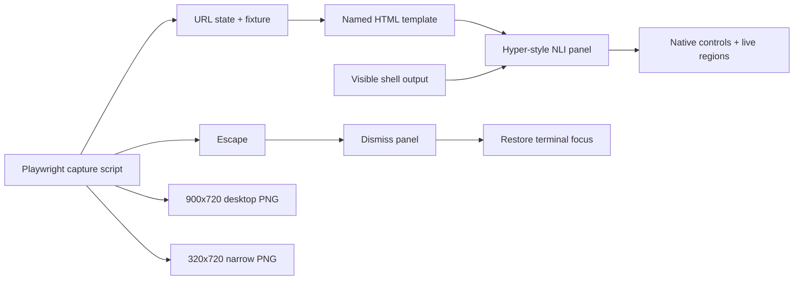

# Task 01: Build responsive interaction mockups

The standalone reference selects a named state from the URL, clones its semantic template into a non-modal panel over a still-visible terminal, and exposes deterministic desktop/narrow fixtures. The capture script renders both sizes, records screenshots, then verifies Escape dismisses the panel and restores terminal focus.

