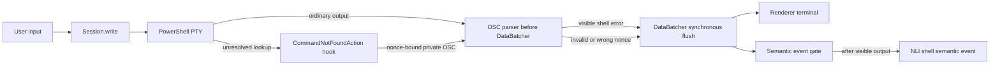

# Task 02: Add authoritative PowerShell failure events

User input stays on Hyper's original synchronous write path. Only a nonce-authenticated unresolved PowerShell lookup becomes a semantic event, and only after ordinary error bytes are flushed.

