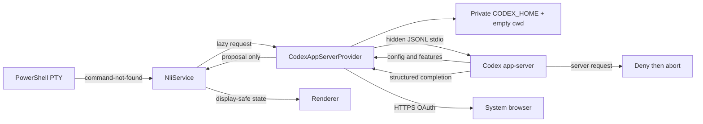

# Task 04: Add the hardened Codex OAuth provider

Hyper lazily creates a main-only Codex app-server provider after an authoritative shell failure. Startup prepares private storage and proves keyring/read-only/no-web/tool-disabled configuration. OAuth uses an HTTPS system-browser URL; interpretation uses ephemeral output-schema turns. Unexpected server requests are denied before the child and active turn fail closed.

