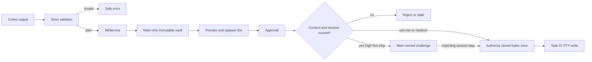

# Task 05: Validate proposals and make approval immutable

Provider output is strictly validated, then a main-only immutable vault binds exact command bytes to the terminal context. The renderer gets display-safe previews and opaque IDs. Main atomically rejects stale/replayed requests and owns the high-risk two-step challenge.

