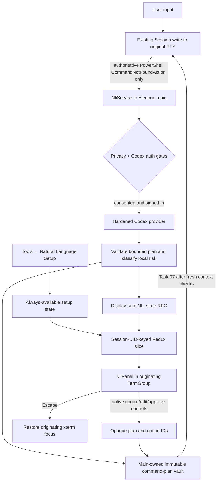

# Task 06: Build the per-pane NLI review experience

Task 06 adds a per-session renderer recovery surface without entering the valid-command hot path. Main remains authoritative for privacy, authentication, plan validation, risk, command bytes, and window identity; renderer state receives display-safe data only and returns opaque choices. Each terminal and its panel share a docked grid so xterm remains visible and resizes naturally.

