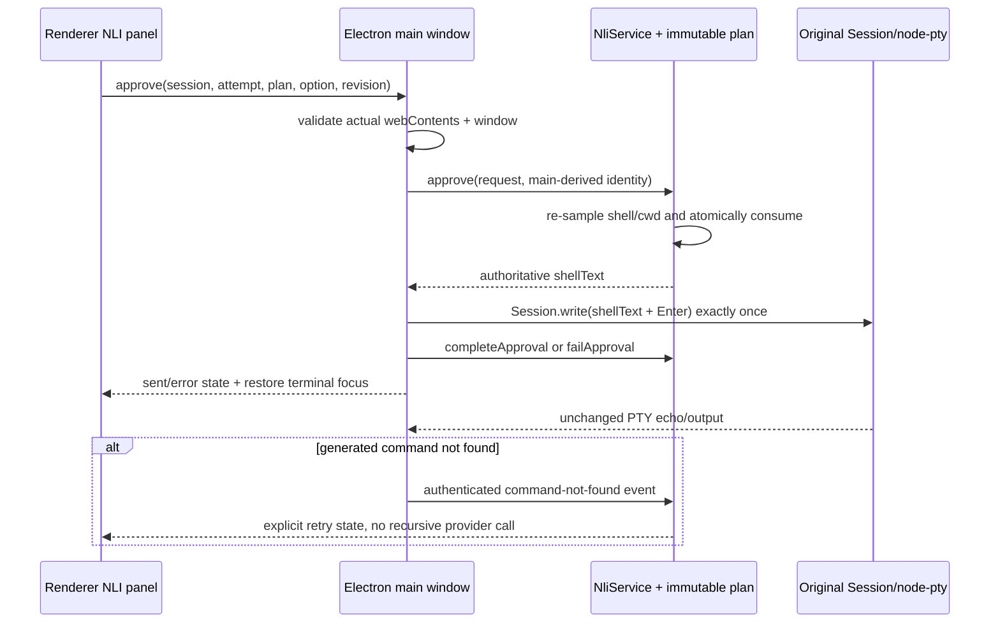

# Task 07: Execute approved text once through the original PTY

The renderer sends only opaque approval identifiers. The main process binds them to the actual Electron sender, re-samples terminal context, atomically consumes the immutable command, and synchronously writes the stored bytes plus PowerShell Enter once to the original Session. Closed sessions do not write; synchronous PTY errors have an unknown outcome and never retry. A later generated command-not-found event is displayed normally and consumed as an explicit-retry state instead of recursively invoking Codex.

