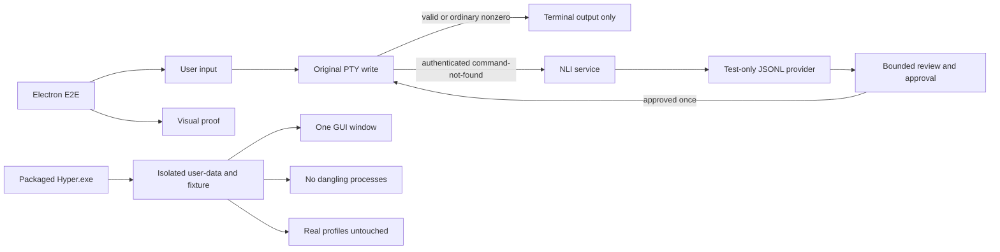

# Task 08: Prove latency, safety, and packaging behavior

Task 08 adds a deterministic test-only provider and exercises the complete shell-first path in the real Electron/PTY application, then packages the Windows app and proves profile/process isolation and responsive visual states.

