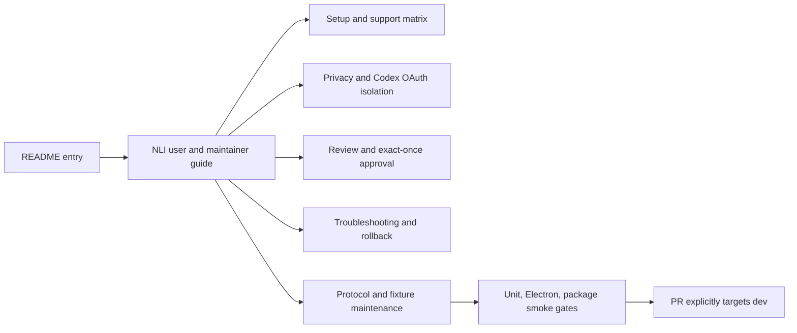

# Task 09: Discover and update documentation

Task 09 documents the implemented shell-first lifecycle from user setup through privacy, OAuth, approval, rollback, and maintainer verification, with README as the discovery entry point and a single authoritative guide.

