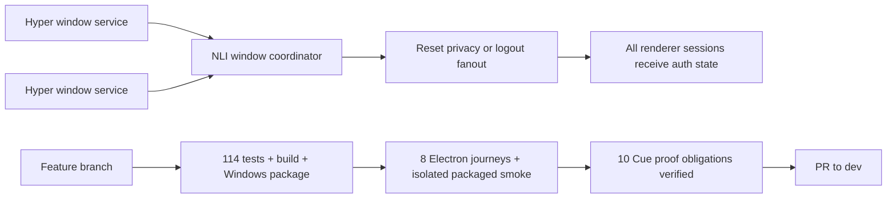

# Task 10: Final integration, review, and dev delivery

Task 10 closes the final delivery gap by coordinating per-install revocation across every live Hyper window, then validating the complete shell-first NLI feature before GitHub delivery.

