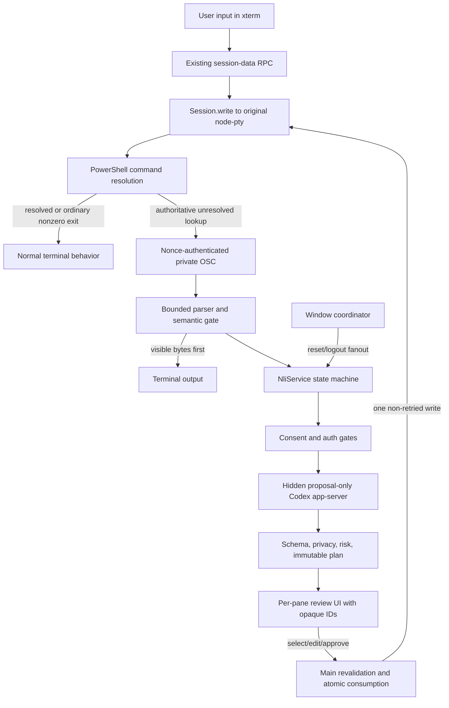

# Shell-first natural-language interface

## User's Request

Make the local Windows Hyper build behave like the production desktop app: one GUI application with a shortcut-ready packaged executable and no separate or dangling terminal window. Add a natural-language fallback where text is always executed by the terminal first, valid commands keep original speed, and AI starts only after the shell authoritatively reports that the command does not exist. Use Codex ChatGPT OAuth, offer choices when several commands fit, and require user approval before executing a suggestion. Deliver the work through a pull request to `dev`, merge it, and fast-forward the local `dev` checkout.

## What We Understood

This is a fallback inside the terminal, not a second command mode or an AI classifier in front of the shell. The implementation therefore includes authoritative PowerShell 5.1/7 command-not-found integration, main-owned proposal/approval state, a hardened proposal-only Codex provider, a per-pane review UI, cross-window privacy/auth revocation, and Windows packaging proof.

The feature deliberately excludes automatic guessing for `cmd.exe`, WSL/SSH wrappers, bash, zsh, fish, arbitrary shells, and REPLs. Those surfaces remain unchanged until an adapter can prove unresolved-command semantics, preserve startup/profile behavior, and meet the same latency, privacy, ordering, and approval guarantees. Live OAuth was not made an automated gate because it would require an interactive user account and write an OS-keyring credential; deterministic seams cover Hyper's side of that boundary.

## Overview

Hyper now has an opt-in, shell-first natural-language assistant. Normal input remains on the original synchronous xterm -> RPC -> node-pty path, while an authenticated unresolved-command event can lazily open a Codex-backed review flow in the affected pane.

Codex can only return structured proposals. Hyper validates and risk-labels them locally, keeps authoritative command bytes in main, invalidates stale/replayed approvals, and writes an accepted command once to the original PTY after explicit approval.

## What Was Built

- Typed root configuration, RPC events, lifecycle states, provider contracts, shell events, display-only renderer data, approval requests, and generated JSON schema.
- Safe PowerShell 5.1/7 startup detection and hook materialization that preserves profiles and an existing command lookup delegate.
- A nonce-authenticated, bounded, chunk-safe OSC parser and semantic gate that preserve malformed, spoofed, oversized, and unrelated terminal bytes visibly.
- A per-session `NliService` state machine that runs after visible shell failure, lazily creates providers, applies privacy/auth gates, deduplicates attempts, and cancels stale work.
- A Codex app-server provider with HTTPS browser ChatGPT login, keyring-only credentials, hidden Windows process creation, private `CODEX_HOME`, empty cwd, allowlisted environment, strict config/capability checks, tool/request denial, JSONL bounds, redacted errors, and deterministic disposal.
- Strict proposal schema validation, local secret-looking-input screening, optional cwd/Git disclosure, immutable plan/digest binding, one-to-three choices or clarification, deterministic risk labels, and second confirmation for high-risk commands.
- An accessible, non-modal, per-pane React/Redux panel for setup, privacy, sign-in, choices, edit/reapproval, clarification, reject, cancel, retry, stale/error, unknown-write, and sent states at desktop and 320 px pane widths.
- Main-owned approval consumption and a synchronous, non-retried write through the original `Session.write`, including renderer identity, pane/shell/cwd/edit staleness checks and generated-command recursion suppression.
- `NliWindowCoordinator` fanout so per-install Reset Privacy and Logout affect every live Hyper window and renderer session.
- README and `docs/natural-language-interface.md` guidance for setup, support, privacy, OAuth/keyring behavior, errors, rollback, verification, and future shell adapters.
- Deterministic fixtures, 113 unit/integration tests, 8 Electron journeys, visual comparisons, production build, unpacked Windows packaging, and an isolated one-app/no-dangling-process smoke script.

## How It Was Achieved

### Shell-first trigger

The normal input call graph was left intact. Supported session startup adds a generated PowerShell hook, but no provider exists on the input hot path. The hook emits one private frame only after PowerShell command resolution remains unresolved; Session flushes ordinary shell output before notifying `NliService`. Latency tests exercise 10,000 dispatches and assert zero provider creation for valid input.

### Proposal-only Codex OAuth

The main process starts `codex app-server` directly with `shell: false`, `windowsHide: true`, piped stdio, a private tool-free home, and an empty directory. Browser login and keyring storage stay owned by Codex; tokens never enter Hyper IPC, Redux, preferences, logs, snapshots, or terminal environment. Startup verifies effective isolation, while account and turn response shapes fail closed when first used.

### Review and approval

Provider output is parsed as bounded structured data and converted to an immutable main-owned plan. Renderer sees labels, rationale, advisory risk, and opaque IDs. Selecting or editing changes the revision; approval revalidates the exact original context and consumes a one-time authorization before one synchronous PTY write. This preserves terminal authority even when delivery outcome is unknown.

### Privacy across windows

Preferences and keyring identity are shared per install, so each BrowserWindow registers its service with a main-process coordinator. Reset and Logout await all live services before broadcasting the resulting auth state; cleanup unregisters the window first. Direct unit tests cover two-window fanout and idempotent unregister.

### Production-like desktop delivery

The final Electron package launches `Hyper.exe` as one GUI application. The isolated smoke validates one root GUI window, zero child top-level windows, no surviving descendants, untouched real Hyper/Codex profiles, and exact temporary cleanup. Provider tests separately prove real Codex spawn uses `windowsHide: true` and is disposed.

## Architecture



## Key Decisions

- Execute first and interpret only authoritative failure, preserving valid-command latency and behavior.
- Support PowerShell 5.1/7 only where a semantic hook can be proven; defer other shells instead of guessing from output.
- Keep provider creation lazy and main-only, with no model or network work on the write hot path.
- Give Codex no tools, repository cwd, project instructions, plugin/MCP inheritance, or execution approval; it proposes structured data only.
- Keep credentials in Codex's OS-keyring flow and delegate in-use token refresh to Codex without token transport through Hyper.
- Keep command bytes and approval authority in main; renderer returns only opaque identity and user decisions.
- Consume one authorization before one synchronous PTY write and never auto-retry an unknown delivery outcome.
- Treat privacy consent and login as per-install state, requiring cross-window reset/logout fanout.
- Preserve integrated parser/hook pairs until existing tabs close when disabling NLI, preventing private frames from becoming visible while stopping all AI work.

## How to Use

1. Build or install the Windows app and open **Tools -> Natural Language Setup**.
2. Enable the feature in Hyper configuration:

   ```js
   naturalLanguageInterface: {
     enabled: true,
     codexExecutable: 'codex'
   }
   ```

3. Open a new interactive PowerShell 5.1 or PowerShell 7 tab. Existing tabs must be reopened after enabling so the startup adapter can be installed.
4. Type commands normally. Valid commands run with the original path and no AI work.
5. If PowerShell cannot resolve natural-language text, review the privacy notice and sign in with ChatGPT when prompted.
6. Choose or edit a proposal, inspect the exact command and risk label, then approve. High-risk text asks for confirmation again.
7. Use **Reset privacy choices** to revoke disclosure consent in every window, or **Log out of Codex** to clear the shared Codex login.

See [Natural-language interface](../../../../docs/natural-language-interface.md) for the full support matrix and troubleshooting guide.

## Testing

The final verified matrix was:

- `pnpm test` — lint plus 113 unit/integration tests, zero failures.
- `pnpm run build` — production Webpack and TypeScript builds.
- `pnpm exec electron-builder --win dir --x64 --publish never` — unpacked Windows package.
- `pnpm test:e2e` — 8 real Electron journeys.
- `scripts/test-nli-packaged.ps1` — isolated one-app/no-child-window/no-dangling-process smoke.
- Cue proof — 10 satisfied obligations, 0 pending; desktop and 320 px reference diffs below 2%.

The final cross-window/provider seam was rechecked with TypeScript, ESLint, and 22 targeted tests after the release matrix. The optional live OAuth smoke remains manual because it opens the browser and writes an OS-keyring credential.

## Memories Saved / Learnings

- `architecture/hyper/nli/hyper-nli-approvals-bind-immutable-main-process-command-bytes-to-terminal-context` — approval authority stays tied to immutable bytes and terminal context.
- `hyper/nli/codex-provider/hyper-codex-app-server-provider-must-prove-isolation-before-oauth-or-turns` — provider isolation must be verified before auth or interpretation.
- `hyper/nli/powershell-authoritative-failure/powershell-command-not-found-integration-needs-typed-delegate-identity-and-current-invocation` — PowerShell integration needs typed delegation and invocation identity.
- `hyper/nli/renderer/per-pane-nli-renderer-stays-docked-typed-and-command-safe` — renderer remains per-pane and display-only.
- `hyper/nli/session-controller/hyper-nli-session-controller-stays-after-visible-shell-output-and-off-the-write-hot-path` — assistance starts after visible failure and outside the write hot path.
- `patterns/hyper/nli-foundation/hyper-nli-contracts-stay-main-authoritative-and-default-off` — contracts remain main-authoritative and opt-in.
- `patterns/hyper/nli-responsive-reference/hyper-nli-mockup-is-a-deterministic-state-fixture` — responsive mockups serve as deterministic state references.
- `pitfalls/terminal/leaked-input-reporting-modes/stray-mouse-focus-escape-sequences-at-the-prompt-are-leaked-dec-private-modes-not-a-hyper-mouse-bug` — distinguish leaked terminal private modes from Hyper input behavior.
- `pitfalls/windows/ava-junction-and-json-schema-lint/windows-worktree-verification-needs-serial-ava-when-node_modules-is-junctioned` — Windows junction worktrees may require serial verification.
- `pitfalls/windows/hyper-local-packaging/windows-local-hyper-must-launch-gui-exe-and-use-matching-snapshots` — use the GUI executable and matching snapshots for local packaging.
- `terminal-intelligence/documentation/shell-first-nli/document-shell-first-ai-as-a-fallback-boundary-rather-than-a-command-mode` — documentation must frame AI as fallback, not command mode.
- `terminal-intelligence/execution/hyper-nli-consumes-main-approval-before-one-original-pty-write` — approval is consumed before exactly one original-PTY write.
- `terminal-intelligence/privacy/cross-window-revocation/per-install-nli-privacy-and-logout-actions-must-fan-out-to-every-window-service` — shared revocation must update all windows.
- `terminal-intelligence/verification/electron-nli-e2e/hyper-nli-e2e-must-separate-user-bytes-from-terminal-protocol-traffic` — E2E must separate user input from terminal protocol traffic.

## Pull Request

[PR #5 — feat: add shell-first natural-language fallback](https://github.com/mcdmag/hyper/pull/5), targeting `dev`.

## Plan Location

`plans/active/terminal-intelligence/001-shell-first-natural-language-interface/`
